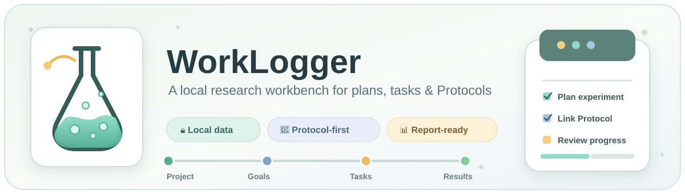
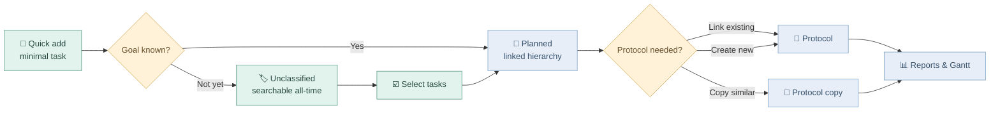

<div align="center">
  

  <p>
    <strong>Plan research. Capture work. Keep evidence close.</strong><br>
    A desktop-first, local research workbench for individual scientists and R&amp;D leads.
  </p>

  <p>
    
    
    
    
  </p>

  <p>
    <a href="#-quick-start">Quick start</a> ·
    <a href="#-research-workflow">Workflow</a> ·
    <a href="#-local-users--data">Local users</a> ·
    <a href="USER_GUIDE_ZH.md">中文指南</a> ·
    <a href="TESTING.md">Testing</a>
  </p>
</div>

---

## 🧭 What WorkLogger is

WorkLogger keeps the daily execution layer of research connected to its planning context and source evidence:

```text
Project → Annual Goal → Monthly Goal → Weekly Goal → Task
                                      ↘ linked Protocol
```

It is designed for one research lead who may manage several projects at once, occasionally prepare progress reports, and reuse experimental or operational procedures without maintaining a heavy category system.

| 🧩 Area | What it helps you do |
| --- | --- |
| **Today** | Capture a minimal task quickly, find unclassified work, and batch-assign tasks to a Weekly Goal. |
| **Projects & Goals** | Maintain the Project → Annual → Monthly → Weekly hierarchy with contextual creation and safe archive rules. |
| **Protocols** | Search, link, duplicate, and edit reusable procedures or research records in one rich-text body. |
| **Reports** | Review work weekly, monthly, or annually; edit tasks inline; export Excel or PDF. |
| **Gantt** | Inspect dated goals with ISO-week ticks and export a smart-cropped, 16:9, high-resolution PNG with a status legend. |
| **Local Users** | Switch between password-free local users whose SQLite databases are completely independent. |

## 🔬 Research workflow



### Low-friction task capture

1. Enter a title and work date in **Today**.
2. Optionally search a Protocol title, create a copy, or choose `+ Create new Protocol`.
3. Save. Tasks without a goal remain `Unclassified`; tasks linked to Annual, Monthly, or Weekly Goals become `Planned`.
4. Use **Select tasks** to classify several tasks through a current-week chip or a Week in **Manage Projects & Goals**.

### Protocols stay close to the work

- The task UI exposes one main Protocol to reduce accidental associations.
- **Quick Edit** contains exactly `Protocol Title`, `Status`, and `Progress note`.
- Procedure text, images, observations, results, and conclusions live together in the Protocol body.
- Copying a similar Protocol is the normal starting point for a new run; the task is saved before the copy opens.

### Review without losing context

- Weekly Report tasks open in an inline editor instead of navigating back to Today.
- Protocol links open in a new tab so report filters and scroll position remain intact.
- Excel is the editable handoff for PPT preparation; PDF remains available for read-only sharing.
- Gantt Year exports support all Projects or one Project. **Smart range** crops empty leading and trailing months; disabling it restores January–December.

## 👤 Local users & data

No passwords or online accounts are involved. The browser stores only the selected local user ID; research content remains in local SQLite files.

| Location | Purpose |
| --- | --- |
| `data/worklogger.db` | Original `User` database, preserved during the multi-user upgrade. |
| `data/users/` | Independent databases for additional active users. |
| `data/retained/` | Databases retained after a user is removed. |
| `data/users.json` | Local user registry; contains names and database paths, not research content. |

Open the top-right ⚙ button to **Manage Local Users**:

- create an empty user;
- merge an active or retained user's database into a new user;
- import a shared WorkLogger `.db` file;
- export any active or retained database;
- remove a user while keeping the database—the recommended default; or
- explicitly delete both the user and database.

During a merge, WorkLogger remaps every Project, Goal, Task, Protocol, tag, and association into the destination database. If a Protocol title already exists, the imported title becomes `Title (Source user)`; another collision receives a number.

> [!IMPORTANT]
> WorkLogger does not synchronize users or databases. Exported `.db` files are snapshots intended for backup, transfer, or controlled merging.

## 🚀 Quick start

### Requirements

- Windows 10 or 11
- Python 3.10, 3.11, or 3.12
- PowerShell or Command Prompt

### Install

```powershell
cd E:\path\to\worklogger
.\setup.bat
```

### Run

```powershell
.\run.bat
```

WorkLogger opens at [http://127.0.0.1:8000](http://127.0.0.1:8000). Press `Ctrl+C` in the launcher window to stop it.

For development:

```powershell
.\.venv\Scripts\python.exe -m uvicorn backend.main:app --host 127.0.0.1 --port 8000 --reload
```

## 🧰 Technical map

```text
frontend/                 Vanilla HTML, CSS and JavaScript
backend/                  FastAPI, SQLAlchemy and user-database services
data/                     Local user registry and ignored SQLite data
docs/assets/              Repository presentation assets
launcher.py               Local server and browser launcher
setup.bat / run.bat       Windows setup and start commands
```

**Runtime stack:** FastAPI · Uvicorn · SQLAlchemy · SQLite · openpyxl · ReportLab · python-docx

The internal API and SQLite schema retain some legacy `experiment` names for existing-data compatibility. The product term is always **Protocol**.

## 🛡️ Safety boundaries

- Desktop-first; no mobile-first compromise for dense research information.
- No team roles, permissions, cloud sync, or collaboration screens.
- No separate inbox: `Unclassified` plus All-time search handles uncategorized work.
- No separate task-result field: results belong in the linked Protocol body.
- Populated planning nodes are archived; deletion is reserved for unused empty nodes.
- Local databases, backups, logs, virtual environments, and user registries are ignored by Git.

Before a manual file-level restore, stop WorkLogger. Prefer **Export DB** for normal backup or sharing.

## 📚 Project guides

| Guide | Purpose |
| --- | --- |
| [QUICKSTART.md](QUICKSTART.md) | Short operational setup and workflow. |
| [USER_GUIDE_ZH.md](USER_GUIDE_ZH.md) | Detailed Chinese user guide for the English interface. |
| [IMPLEMENTATION_STATUS.md](IMPLEMENTATION_STATUS.md) | Current implemented and deferred scope. |
| [PROJECT_SUMMARY.md](PROJECT_SUMMARY.md) | Product model and architecture summary. |
| [TESTING.md](TESTING.md) | Manual regression checklist. |
| [CONTEXT.md](CONTEXT.md) | Product terminology and design decisions. |

---

<div align="center">
  <sub>Built as a calm, local laboratory bench for research work—not another generic team task board.</sub>
</div>
